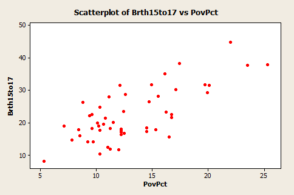
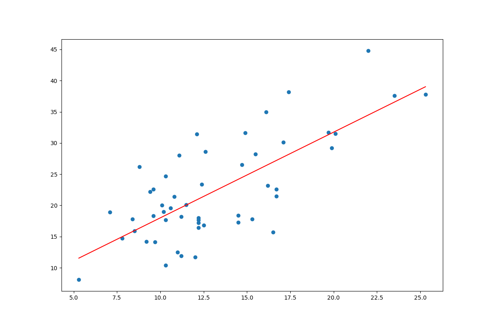

# Supervised Learning - Linear Regression from Scratch Programming Exercise

### **Introduction**
In this exercise, we ask you to program a simple Linear Regression model that computes a cost function from scratch. Then, we ask you to debug the function `gradient_descent` which finds the optimal parameter combination that best minimizes the cost function. 

Helper functions will be provided to load and transform the data into the required format (numpy matrices).

### **Pre-requisites**
- Python 3.x installed
- [Virtualenv](https://virtualenv.pypa.io/en/latest/)
- An IDE of choice
- Git Bash (Windows users)

### **A. Set-up (5 mins)**
1. Navigate to the folder `sup_learning/linear_regression`
```
$ cd sup_learning/linear_regression
```
2. Open a terminal in your IDE of choice and create a virtual environment `venv`
```
$ virtualenv venv
```
3. Activate the virtual environment
```
$ source venv/bin/activate
```
4. Install the required dependencies for this interview
```
$ (venv) pip install -r requirements.txt
```

### **B. Create Linear Regression Model (20 mins)**
We will be implementing regression analysis on a dataset that maps teen birth rates with poverty level data in the United States. The dataset contains $n=51$ rows, containing data for each of the states in the country.

For simplicity, you can assume that the dataset does not contain null values and doesn't require any transformations.

Our variables of interest are:

* $y = $ 2002 birth rate per 1000 females 15-17 years old

* $x_1 = $ Poverty rate (measured in percentages)

Here's a scatterplot displaying the linear relationship between $y$ and $x_1$:



Your task is to create a linear regression model that is able to fit an optimal line against the data using batch gradient descent. The file `your_code.py` defines the two functions that you need for this process:

1- `compute_cost`: In regression analysis, the goal is to minimize the difference between the predicted values $h_\theta(x)$ and the actual values $y$, where the hypothesis $h_\theta(x)$ is given by the linear model:

$$ h_\theta(x) = \theta_0 + \theta_1x_1 $$

This difference is called the **residual**. Therefore, the optimization problem boils down to minimizing the **sum of squared residuals (SSR)**, where SSR is defined by:
$$SSR = \sum_{i=1}^{m}(h_\theta(x^{(i)}) - y^{(i)})^{2},$$

and its corresponding cost function as:

$$ J(\theta) = \frac{1}{2m}SSR. $$

The first part of this exercise consists of writing this function from scratch.

2- `gradient_descent`: Gradient descent is an optimization algorithm that works by efficiently searching the parameter space - in our case, intercept($\theta_0$) and slope($\theta_1$) - and iteratively updating the parameters according to the following rule:

$$ \theta := \theta -\alpha \frac{\delta}{\delta \theta}J(\theta).$$

Your task now is to insert the missing code in the function `gradient_descent` (look for sections with `###YOUR CODE HERE###`).

### **C. Test your model and discuss results (10 mins)**

Run the file `your_code.py` from terminal
```
$ python your_code.py
```
If the cost and gradient descent functions were correctly implemented, you should be able to see the visualization of your regression line as follows:

